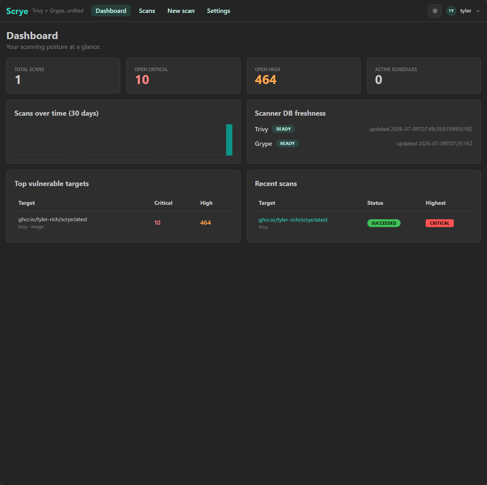
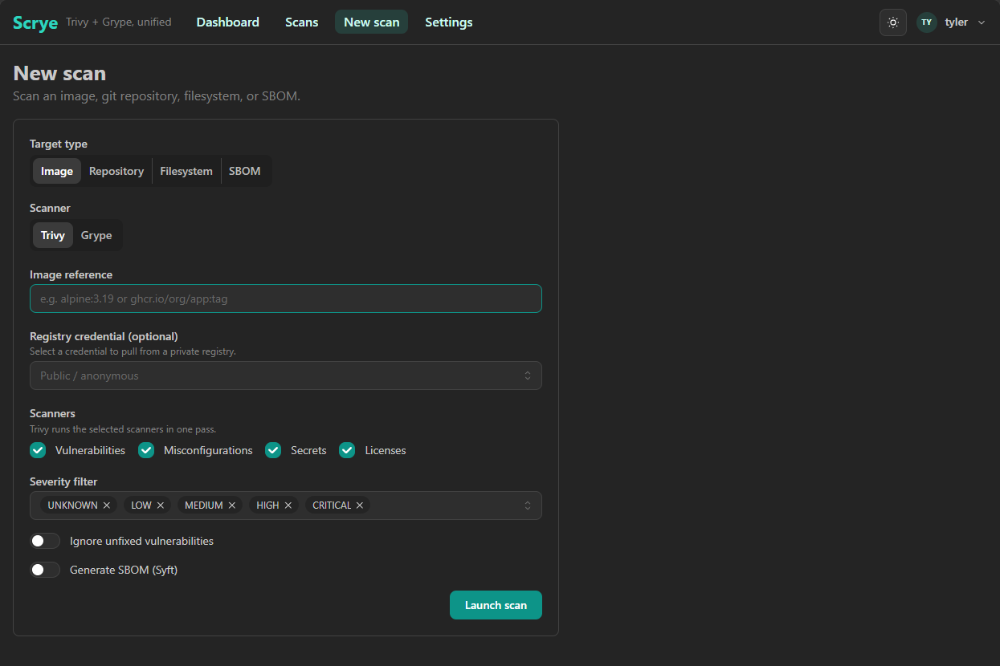
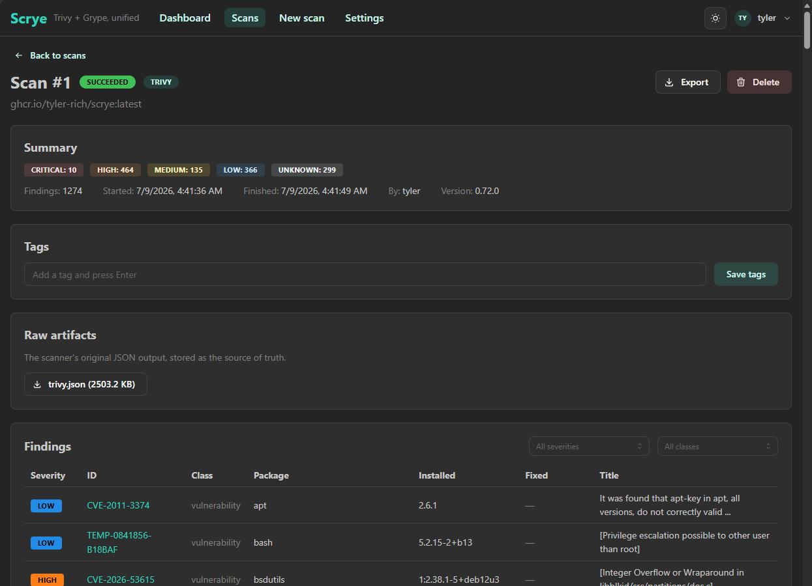
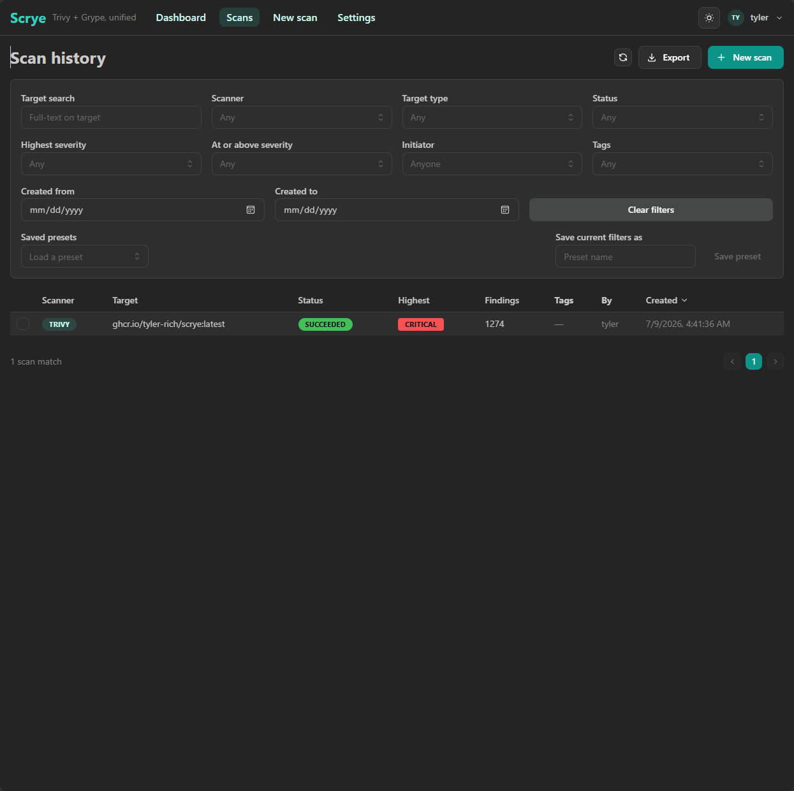

# Scrye

> A unified, self-hosted web UI for the **Trivy** and **Grype** scanners.
> _("Scry": to perceive hidden things — fused with "scan.")_

Scrye puts a clean, modern browser UI in front of two best-in-class open-source
security scanners — [Trivy](https://github.com/aquasecurity/trivy) (Aqua
Security) and [Grype](https://github.com/anchore/grype) (Anchore) — so you can
run, review, export, and track vulnerability and configuration scans from one
place, on your own infrastructure. It orchestrates the official scanner binaries,
persists their raw JSON as the source of truth, and normalizes the results into a
single findings model so Trivy and Grype render in one table.

[](https://github.com/tyler-rich/Scrye/actions/workflows/ci.yml)
[](https://github.com/tyler-rich/scrye/pkgs/container/scrye)

[](./LICENSE)

- **What it is:** one container that serves a React SPA and a FastAPI backend,
  runs `trivy`/`grype`/`syft` as subprocesses, and stores everything in SQLite.
- **Who it's for:** teams and homelabbers who want a self-hosted, hardened scan
  console with history, exports, scheduling, notifications, RBAC, and OIDC —
  without wiring a pipeline together by hand.
- **Distribution:** published to the GitHub Container Registry (GHCR):
  `ghcr.io/tyler-rich/scrye:latest` and `:<version>` for stable releases, and the
  moving `:dev` tag from the nightly `dev` build. You can also build the image
  locally from this repo. (No Docker Hub.)

---

## Contents

- [Screenshots](#screenshots)
- [Features](#features)
- [Integrations](#integrations)
- [Architecture](#architecture)
- [Requirements](#requirements)
- [Deploying with Docker](#deploying-with-docker)
  - [1. Prerequisites](#1-prerequisites)
  - [2. Create the application master key](#2-create-the-application-master-key)
  - [3. Create `docker-compose.yml`](#3-create-docker-composeyml)
  - [4. Start it](#4-start-it)
  - [5. First-run setup (admin bootstrap)](#5-first-run-setup-admin-bootstrap)
  - [6. Where persistent data lives](#6-where-persistent-data-lives)
  - [Which image tag?](#which-image-tag)
  - [Build from source instead](#build-from-source-instead)
  - [Troubleshooting first-run issues](#troubleshooting-first-run-issues)
- [Configuration](#configuration)
- [Reverse proxy (TLS)](#reverse-proxy-tls)
- [Optional sidecars](#optional-sidecars)
- [Configuring OIDC](#configuring-oidc)
- [Usage](#usage)
- [Security model](#security-model)
- [Backup & restore](#backup--restore)
- [Monitoring](#monitoring)
- [Building the image yourself](#building-the-image-yourself)
- [Roadmap](#roadmap)
- [Contributing](#contributing)
- [License](#license)

---

## Screenshots

| Dashboard | New scan | Results | History |
| --------- | -------- | ------- | ------- |
|  |  |  |  |

---

## Features

Trivy and Grype each bring a different scope; Scrye unifies them behind one UI
and one normalized findings model.

- **Trivy scanning**
  - Targets: a **single container image** (registry reference) and a **git
    repository** (public or private, by HTTPS clone URL with optional
    branch/commit/tag).
  - Scanners (selectable per scan, default all): **vulnerabilities/CVEs**
    (`vuln`), **misconfiguration/IaC** (`misconfig`), **secrets** (`secret`),
    and **licenses** (`license`). An optional Syft **SBOM** can be generated
    alongside an image scan.
  - Per-scan options: scanner selection, severity filter
    (`UNKNOWN`…`CRITICAL`), `--ignore-unfixed`, repo branch/commit/tag, and SBOM
    format. **VEX policy** and **`.trivyignore`** rules are managed **globally**
    (Settings → Trivy policy) and applied to every Trivy scan, not entered
    per-scan.
- **Grype scanning** (vulnerabilities — Grype's scope)
  - Targets: **container image**, **filesystem/directory** (a mounted path
    under an admin-configured allowlist — disabled by default), and an existing
    **SBOM** (uploaded CycloneDX / SPDX / Syft JSON). A global Grype ignore
    config (Settings → Scanners) is applied to every Grype scan.
- **Syft** generates one SBOM per artifact on request, stored as a downloadable
  artifact and usable as a Grype SBOM target.
- **Private registries** — a transient, in-memory Docker `config.json` is
  materialized in tmpfs at scan time from a stored, field-encrypted credential.
  Static username/password and token credentials work out of the box; ECR/GCR/ACR
  credential-helper config is generated, but the **helper binaries are not
  bundled** — those registry types work only where the helper is present in the
  runtime environment.
- **Normalized findings** — raw scanner JSON is persisted verbatim as the source
  of truth, then normalized into a shared model with a 6-level severity scale so
  Trivy and Grype findings render in one table.
- **Exports** — **CSV**, **Markdown**, and **JSON**, per scan or across a
  filtered history set (with CSV formula-injection guards).
- **Scan history** — a filterable, sortable, paginated table (by scanner, target
  type, target text search, status, date range, initiator, highest severity,
  severity threshold, and tags), with **saved presets** and per-scan **tags**.
- **Scan diff** — compare two scans of the same target/scanner/type to see **new
  vs. fixed** findings and the per-severity delta over time.
- **Dashboard** — aggregate posture: total scans, a 30-day trend, top vulnerable
  targets, open critical/high (from the latest scan per target), scanner-DB
  freshness, recent scans, and failed-scan alerts.
- **Scheduled scans** — recurring scans on a standard 5-field **cron** cadence,
  from a saved scan template, with a "run now" action.
- **Notifications** — event-driven dispatch on **scan completed / scan failed /
  critical-or-high findings** to **webhook / Discord / SMTP / Matrix** channels,
  each subscribing to the events it cares about, each with a "send test" action.
- **Result retention** — optionally prune the raw scanner artifacts of old scans
  to bound disk usage while keeping the scan rows and normalized findings.
- **Metrics** — an authenticated Prometheus **`/metrics`** endpoint.
- **Authentication** — local accounts (**argon2id**) with revocable server-side
  sessions, optional **TOTP MFA** (with an enforceable policy), personal **API
  tokens**, and generic **OIDC** alongside local auth. **RBAC**: viewer /
  operator / admin.
- **Secrets handling** — stored credentials are field-encrypted with
  **AES-256-GCM**; the master key comes from a Docker secret file; secret API
  fields are write-only. (See [Security model](#security-model).)
- **Backup & restore** — portable, passphrase-protected bundles that re-key
  secrets on restore; optional scheduled backups with retention.

## Integrations

- **Trivy**, **Grype**, **Syft** — official binaries (currently Trivy `0.72.0`,
  Grype `0.115.0`, Syft `1.46.0`), orchestrated and parsed from their JSON output
  (Scrye never reimplements scanner logic). All three are Apache-2.0; their
  `LICENSE`/`NOTICE` files are bundled unmodified in the image at
  `/THIRD_PARTY_LICENSES` (see
  [`THIRD_PARTY_LICENSES/`](THIRD_PARTY_LICENSES/README.md)).
- **OIDC** — generic OpenID Connect (Authlib, authorization-code + PKCE, RS256).
  Configured entirely in the UI; works with any compliant provider (developed
  against Pocket ID).
- **Docker** — image enumeration via a **read-only** `docker-socket-proxy`
  sidecar; the app never mounts the Docker socket itself.
- **Private registries** — static credentials (built in); ECR/GCR/ACR credential
  helpers where the deployment provides the helper binary.
- **Notification channels** — webhook / Discord / SMTP / Matrix, dispatched on
  scan events.
- **Prometheus** — an authenticated `/metrics` endpoint for scraping.

---

## Architecture

```
                         ┌───────────────────────────────────────────────┐
   Browser ── HTTPS ──▶  │  Reverse proxy + TLS (Caddy / nginx / Traefik) │
                         └───────────────────────────────────────────────┘
                                            │ HTTP (loopback / internal net)
                                            ▼
        ┌──────────────────────────────────────────────────────────────────┐
        │  Scrye container (single image)                                    │
        │  ┌────────────────────┐   ┌──────────────────────────────────┐    │
        │  │ FastAPI API + SPA  │   │ In-process async scan worker     │    │
        │  │ - REST endpoints   │◀─▶│ - claims queued `scans` rows     │    │
        │  │ - serves React SPA │   │ - runs trivy/grype/syft subproc  │    │
        │  │ - auth / sessions  │   │ - parses JSON → findings         │    │
        │  └────────┬───────────┘   └───────────────┬──────────────────┘    │
        │           ▼                                ▼                       │
        │   ┌────────────────┐             ┌──────────────────┐             │
        │   │ SQLite (/data) │             │ trivy/grype/syft │             │
        │   │ field-encrypted│             │ binaries + DBs   │             │
        │   │   secrets      │             │ (/cache)         │             │
        │   └────────────────┘             └──────────────────┘             │
        └──────────────────────────────────────────────────────────────────┘
              │ optional sidecars (compose profiles):
              ├── trivy-server        (shared vuln-DB cache)
              └── docker-socket-proxy (read-only) ── "scan running images"
```

- **FastAPI app** serves the REST API and the built React SPA, and handles auth,
  running database migrations (`alembic upgrade head`) on startup.
- **In-process async worker** runs scans (DB-backed `scans` table + a
  concurrency semaphore) behind a thin `ScanWorker` interface — no Redis/arq in
  v1, but swappable later. On startup it recovers interrupted scans.
- **SQLite** holds all state; stored secrets are field-encrypted at the app
  layer. Raw scanner JSON and generated SBOMs live on disk under `/data`.
- **Scanner binaries** (`trivy`/`grype`/`syft`) are bundled and run as
  subprocesses, with their databases and scratch space on the `/cache` volume.

---

## Requirements

- **Docker** 24+ and the **Compose v2** plugin (Buildx for a multi-arch build).
- **~2 GB RAM** available to the container for typical scans (the shipped Compose
  limit). Sufficient for images around 1 GB unpacked, including SBOM generation;
  raise the limit for substantially larger images.
- **Disk for the `/cache` volume — plan for ≥ 10 GB.** Everything the scanners
  read and write at scan time lives on this named volume (`scrye_cache`):
  - **Trivy vulnerability DB:** ~1.2 GB (downloads once, persists across
    restarts, refreshed incrementally).
  - **Trivy Java index DB:** up to ~1 GB more, downloaded on demand the first
    time a Java artifact is scanned.
  - **Grype vulnerability DB:** ~1.5–2 GB (downloads once, then incremental
    updates).
  - **Transient image staging:** while an image scan runs, layers are unpacked
    under `/cache/tmp` — budget roughly the **uncompressed size of the largest
    image you scan** (e.g. a ~330 MB-compressed image stages ~1.1 GB, cleaned up
    when the scan finishes).
- **The `/tmp` tmpfs stays small (200 MB) on purpose.** tmpfs is **RAM-backed** —
  every byte written there is charged against the container's memory limit.
  `/tmp` holds only transient credential files (a few KB); all large scanner
  writes go to the disk-backed `/cache` volume instead. Do **not** enlarge the
  tmpfs to "fix" a disk-space error — a multi-GB tmpfs would let image staging
  consume RAM and OOM the container. (See
  [Troubleshooting](#troubleshooting-first-run-issues).)
- Optional sidecars: a **Trivy server** (shared vuln-DB cache) and a read-only
  **docker-socket-proxy** (to scan running images). Both off by default — see
  [Optional sidecars](#optional-sidecars).
- For native (non-container) development: **Python 3.13**, **Node 20+**, and the
  `trivy`/`grype`/`syft` binaries on `PATH`. See [CONTRIBUTING.md](./CONTRIBUTING.md).

---

## Deploying with Docker

The fastest path is to **pull the published image from GHCR** — you do **not**
need to clone this repository. Create a directory, drop in the master-key secret
and a `docker-compose.yml`, and bring it up. (Prefer to build from source? See
[Build from source instead](#build-from-source-instead).)

### 1. Prerequisites

- Docker 24+ with Compose v2 (`docker compose version`).
- `openssl` (to generate the master key) — present on essentially every
  Linux/macOS host.
- A working directory for the deployment:

  ```bash
  mkdir -p scrye/secrets && cd scrye
  ```

### 2. Create the application master key

The **master key** encrypts all stored secrets. It is provided as a **Docker
secret file**, never an environment variable or image layer. Generate it once:

```bash
openssl rand -base64 48 > secrets/app_secret_key
chmod 600 secrets/app_secret_key
```

In production Scrye **refuses to start** without a valid key file. **Back this
file up** — losing it makes every stored secret unrecoverable. (Key rotation is
supported; see [The master key](#the-master-key).)

### 3. Create `docker-compose.yml`

Save this next to the `secrets/` directory you just created. It runs the
**published GHCR image** with the same hardened, CIS-aligned posture the project
ships (non-root, read-only root FS, dropped capabilities, resource limits,
loopback-only port, healthcheck):

```yaml
services:
  scrye:
    image: ghcr.io/tyler-rich/scrye:latest # or :<version> to pin a release
    user: "1000:1000"
    read_only: true
    security_opt:
      - "no-new-privileges:true"
    cap_drop:
      - "ALL"
    ports:
      # Loopback only — put a reverse proxy in front for TLS/external access.
      # For a quick local trial without a proxy, change to "8089:8089".
      - "127.0.0.1:8089:8089"
    environment:
      - SCRYE_DATABASE_PATH=/data/scrye.db
      - SCRYE_APP_SECRET_KEY_FILE=/run/secrets/app_secret_key
      # REQUIRED behind a reverse proxy: the IP/CIDR your proxy connects FROM.
      # The default below fits a proxy container on the default Docker bridge;
      # set it to match your topology (see "Reverse proxy" below). Never "*".
      - SCRYE_FORWARDED_ALLOW_IPS=172.16.0.0/12
    secrets:
      - app_secret_key
    volumes:
      - scrye_data:/data # SQLite DB, raw artifacts, backups — BACK THIS UP
      - scrye_cache:/cache # scanner vuln DBs + scratch (≥10 GB; reconstructible)
    tmpfs:
      # RAM-backed, owned by uid 1000, holds only transient credential files.
      # Do NOT enlarge to "fix" a scanner disk error — see "Requirements".
      - /tmp:size=200m,mode=1700,uid=1000,gid=1000
    deploy:
      resources:
        limits:
          cpus: "2.0"
          memory: 2G
        reservations:
          memory: 256M
    healthcheck:
      test: ["CMD", "curl", "-fsS", "http://localhost:8089/healthz"]
      interval: 30s
      timeout: 10s
      retries: 3
      start_period: 20s
    restart: unless-stopped
    logging:
      driver: json-file
      options:
        max-size: "10m"
        max-file: "3"

volumes:
  scrye_data:
  scrye_cache:

secrets:
  app_secret_key:
    file: ./secrets/app_secret_key # created in step 2; never commit it
```

### 4. Start it

```bash
docker compose up -d

# Verify health
curl -fsS http://127.0.0.1:8089/healthz
# {"status":"healthy","version":"0.1.0","database":"ok"}
```

On startup the container applies database migrations (`alembic upgrade head`) and
then serves the API and SPA. Because the port is published to **loopback only**,
put it behind a [reverse proxy](#reverse-proxy-tls) for TLS and external access
(or change the port mapping to `8089:8089` for a quick local trial over plain
HTTP).

### 5. First-run setup (admin bootstrap)

Open <http://127.0.0.1:8089/> in a browser. While **no accounts exist**, Scrye
shows a one-time **setup screen** that creates the first account as **admin** and
signs it in. The underlying endpoint (`POST /api/auth/setup`) works exactly once
— as soon as any account exists it permanently returns 409 and the screen is
gone. You can also bootstrap via the API:

```bash
curl -X POST http://127.0.0.1:8089/api/auth/setup \
  -H 'Content-Type: application/json' \
  -d '{"username": "admin", "password": "<a strong passphrase, 12+ chars>"}'
```

Additional users are created by an admin (Settings → Users & roles, or
`POST /api/users`) with one of three roles:

- **viewer** — read and export.
- **operator** — viewer + launch scans, delete completed scans, manage own scan
  tags, own API tokens, and scheduled scans.
- **admin** — everything, including settings, users, credentials, and
  backup/restore.

### 6. Where persistent data lives

Two named Docker volumes:

- **`scrye_data`** → `/data` — the SQLite database (`/data/scrye.db`), raw
  scanner artifacts (`/data/artifacts`), and backup bundles (`/data/backups`).
  **This is the volume to back up.**
- **`scrye_cache`** → `/cache` — scanner vulnerability databases and scan-time
  scratch space. Large but reconstructible; it re-downloads if lost.

Inspect their host paths with `docker volume inspect scrye_scrye_data`. For a
fixed on-disk location, replace the named volumes with bind mounts to a directory
you control (e.g. `/mnt/appdata/scrye/data:/data`).

### Which image tag?

Everything publishes to GHCR (`ghcr.io/tyler-rich/scrye`):

| Tag | What it is | Use it for |
| --- | ---------- | ---------- |
| `:latest` | The most recent tagged release (built from `main`). | **Production.** Tracks the newest release. |
| `:<version>` (e.g. `:1.4.0`) | A specific tagged release. | **Production, pinned** — reproducible, no surprise upgrades. |
| `:dev` | A **moving** tag rebuilt nightly from the `dev` branch. | **Testing HEAD-of-dev only.** Not a release; may be unstable. Do not run in production. |

Pin `:<version>` for anything you care about; use `:latest` if you want to track
releases and re-`pull` on your own cadence. All tags are multi-arch
(`linux/amd64` + `linux/arm64`).

```bash
docker pull ghcr.io/tyler-rich/scrye:latest
# docker pull ghcr.io/tyler-rich/scrye:1.4.0   # pin a release
# docker pull ghcr.io/tyler-rich/scrye:dev      # test the dev branch
```

### Build from source instead

If you'd rather build the image yourself (to modify Scrye, or to avoid pulling a
prebuilt image), clone the repo and use the bundled Compose file, which **builds
locally** instead of pulling:

```bash
git clone https://github.com/tyler-rich/scrye.git
cd scrye
mkdir -p docker/secrets
openssl rand -base64 48 > docker/secrets/app_secret_key
docker compose -f docker/docker-compose.yml up --build -d
```

See [Building the image yourself](#building-the-image-yourself) for multi-arch
builds and the dogfooding self-scan.

### Troubleshooting first-run issues

- **`{"status":"degraded",...,"database":"error"}` from `/healthz`.** The process
  is up but can't reach SQLite. Check that `/data` is writable by uid 1000 (the
  container runs non-root) and that the `scrye_data` volume mounted.
- **Container exits at start with `refusing to start: master key file …`.** The
  `app_secret_key` secret file is missing or empty. Re-run
  [step 2](#2-create-the-application-master-key) and confirm
  `secrets/app_secret_key` exists and is non-empty.
- **`exec /app/entrypoint.sh: no such file or directory`** (only when building
  from source). The entrypoint was checked out with CRLF line endings (a Windows
  checkout). The repo pins shell scripts to LF via `.gitattributes` and the image
  strips stray CRs, so a normal clone is fine; if you hit this, run
  `git add --renormalize .` and rebuild.
- **Scanner fails with `mkdir /app/.cache: read-only file system` or
  `no space left on device`.** This is the classic hardened-runtime cache-path
  issue. Scrye runs non-root on a **read-only root filesystem**, so a scanner's
  default cache (`$HOME/.cache`) is unwritable and the small `/tmp` tmpfs can't
  hold a multi-GB vulnerability DB or image staging. The shipped image already
  routes all scanner cache and temp writes to the disk-backed `/cache` volume
  (`TRIVY_CACHE_DIR`, `GRYPE_DB_CACHE_DIR`, `XDG_CACHE_HOME`/`HOME`, `TMPDIR`) and
  mounts `/tmp` owned by uid 1000 — provided you keep the `scrye_cache` volume and
  the `/tmp` tmpfs from the compose above. If you see this, confirm those mounts
  are present and that `/cache` has ≥ 10 GB free, and that you're on a **current
  image** (`docker pull …:latest`). Do **not** try to fix it by enlarging the
  `/tmp` tmpfs; that trades a disk error for an OOM (tmpfs is RAM-backed).
- **Filesystem scans are rejected.** Filesystem (Grype `dir:`) scanning is
  **disabled by default**. An admin must set `SCRYE_FILESYSTEM_SCAN_ROOTS` to one
  or more absolute paths and mount them into the container; targets outside those
  roots are refused.

---

## Configuration

Configuration is driven by environment variables (prefix `SCRYE_`). The
[`.env.example`](./.env.example) file is **generated from the backend `Settings`
model** (`backend/app/core/config.py`). Only **non-sensitive** variables belong
in the environment; the master key is always the Docker secret file.
Runtime-editable, non-secret options (instance name, auth policy, scanner
defaults, retention) are **not** env vars — they live in the app's Settings UI
and database.

Every variable has a working default; the **Need** column says when you actually
have to touch it:

- **Required** — must be present/correct for a normal deployment.
- **Conditional** — only matters under the named circumstance; ignore otherwise.
- **Optional** — a tuning knob; the default is fine for most deployments.

| Variable | Default | Need | Description |
| -------- | ------- | ---- | ----------- |
| `SCRYE_APP_SECRET_KEY_FILE` | `/run/secrets/app_secret_key` | **Required** | Path to the Docker secret file holding the **master key**. The file *must* exist at this path; the default matches the compose secret. |
| `SCRYE_FORWARDED_ALLOW_IPS` | `172.16.0.0/12` | **Required** *(behind a proxy)* | IP/CIDR your reverse proxy connects **from** — the trust boundary for `X-Forwarded-For`. Set it to match your topology (see [Reverse proxy](#reverse-proxy-tls)). Never `*`. Irrelevant only if nothing fronts Scrye. |
| `SCRYE_SESSION_COOKIE_SECURE` | `true` | **Conditional** | Set `false` **only** for plain-HTTP local dev; keep `true` in production (behind TLS). |
| `SCRYE_CORS_ORIGINS` | _(empty)_ | **Conditional** | Comma-separated origins for a **split dev frontend** (e.g. `http://localhost:5173`). Empty for the normal same-origin SPA. |
| `SCRYE_TRIVY_SERVER_URL` | _(unset)_ | **Conditional** | Only when the [`trivy-server` sidecar](#optional-sidecars) is enabled (e.g. `http://trivy-server:4954`). |
| `SCRYE_DOCKER_PROXY_URL` | _(unset)_ | **Conditional** | Only for ["scan running images"](#optional-sidecars) via the read-only docker-socket-proxy (e.g. `http://docker-socket-proxy:2375`). |
| `SCRYE_FILESYSTEM_SCAN_ROOTS` | _(empty)_ | **Conditional** | Comma-separated absolute paths under which Grype `dir:` scans are allowed. Empty **disables** filesystem scanning; set it (and mount the paths) to enable. |
| `SCRYE_ALLOW_INTERNAL_EGRESS` | `false` | Optional | Allow server-side fetchers (notification webhook/SMTP/Matrix, the registry probe) to reach **private/internal** addresses. Off by default to block SSRF; enable only if you use an internal SMTP relay or private registry. Loopback and cloud-metadata addresses are **always** refused. |
| `SCRYE_APP_NAME` | `Scrye` | Optional | Application name shown in the UI and logs. |
| `SCRYE_ENVIRONMENT` | `production` | Optional | `development` or `production`. |
| `SCRYE_LOG_LEVEL` | `INFO` | Optional | Root log level. |
| `SCRYE_HOST` | `0.0.0.0` | Optional | Bind address inside the container (published to loopback by the port mapping). |
| `SCRYE_PORT` | `8089` | Optional | API/SPA port inside the container. |
| `SCRYE_DATABASE_PATH` | `/data/scrye.db` | Optional | SQLite database file path. |
| `SCRYE_SESSION_LIFETIME_HOURS` | `168` | Optional | Login session lifetime (hours; 168 = 7 days). |
| `SCRYE_AUTH_RATE_LIMIT_ATTEMPTS` | `5` | Optional | Max auth attempts per client IP per window. |
| `SCRYE_AUTH_RATE_LIMIT_WINDOW_SECONDS` | `60` | Optional | Auth rate-limit window length (seconds). |
| `SCRYE_MAX_CONCURRENT_SCANS` | `2` | Optional | Max scans the in-process worker runs at once. |
| `SCRYE_SCAN_TIMEOUT_SECONDS` | `1800` | Optional | Per-scan wall-clock timeout (seconds). |
| `SCRYE_SCANNER_MAX_OUTPUT_BYTES` | `536870912` | Optional | Max stdout (512 MiB) captured from a scanner subprocess; output past this kills and fails the scan. |
| `SCRYE_SCANNER_CACHE_DIR` | `/cache` | Optional | Writable volume for scanner vuln DBs and scratch (see [Requirements](#requirements)). |
| `SCRYE_ARTIFACTS_DIR` | `/data/artifacts` | Optional | Directory holding raw scanner artifacts (JSON output, SBOMs). |
| `SCRYE_BACKUPS_DIR` | `/data/backups` | Optional | Directory holding backup bundles (manual and scheduled). |
| `SCRYE_TRIVY_BINARY` | `trivy` | Optional | Trivy binary path/name (resolved on `PATH` if a bare name). |
| `SCRYE_GRYPE_BINARY` | `grype` | Optional | Grype binary path/name. |
| `SCRYE_SYFT_BINARY` | `syft` | Optional | Syft binary path/name. |
| `SCRYE_FRONTEND_DIST_DIR` | `/app/frontend/dist` | Optional | Directory of the built SPA served by FastAPI. |

One Compose-level variable is **not** a Scrye setting and so is not in the table
above: `DOCKER_GID`. It is read only by `docker/docker-compose.yml`, only when
the [`docker-env` profile](#docker-socket-proxy--scan-running-images) is enabled,
and it must be the **host's** docker group id
(`stat -c '%g' /var/run/docker.sock`) — the socket proxy runs unprivileged and
needs that group to read the socket. It defaults to `999` (the Debian/Ubuntu
default), which is a fallback, not a guarantee.

### The master key

The application **master key** is **never** an environment variable or baked into
an image layer. It is read at runtime from the Docker secret file pointed to by
`SCRYE_APP_SECRET_KEY_FILE` (default `/run/secrets/app_secret_key`). Generate it
once with `openssl rand -base64 48` and provide it as a Docker secret. Stored
credentials are encrypted with a key derived from it (HKDF-SHA256 → AES-256-GCM).
In production the app **refuses to start** without a valid key file.

**High-entropy key required.** The key file must be **valid base64 that decodes to
at least 32 bytes** — exactly what `openssl rand -base64 48` produces. A raw
passphrase (anything that isn't valid base64) is **rejected** on startup, because a
low-entropy key could be brute-forced offline against a stolen database at HKDF
speed. If you are upgrading a deployment that used a passphrase key, set
`SCRYE_ALLOW_WEAK_MASTER_KEY=1` to boot **just long enough to rotate** to a proper
key — it logs a warning on every start and is not meant to be left enabled.

**Key rotation.** The key file may hold multiple versions, one per line, as
`v<N>:<base64>` entries (a plain single-line key is version 1). New secrets are
encrypted under the highest version and older versions remain readable, so you can
add a new version and restart safely. Note that v1 does **not** yet ship an
admin-facing bulk re-encryption action, so existing rows stay wrapped under the
version they were written with until each is next updated; keep the older key line
in place until that tool lands (tracked on the [roadmap](./docs/ROADMAP.md)).

---

## Reverse proxy (TLS)

Scrye serves **plain HTTP** internally and (with the compose above) binds to
**loopback**. In production you front it with a TLS-terminating reverse proxy.
Any proxy that sets `X-Forwarded-For` works — the client-IP logic is
proxy-agnostic.

**One setting is required:** `SCRYE_FORWARDED_ALLOW_IPS` must be the IP/CIDR the
proxy connects to Scrye **from**, so Scrye trusts the forwarded client IP (used
by the auth rate limiter and audit log). If it doesn't match, Scrye **fails safe**
— it ignores `X-Forwarded-For` and uses the raw peer IP (no spoofing, but
per-client rate-limiting/audit IPs won't apply until you set it right). **Never
set it to `*`.** See [Security model](#security-model) for the full rationale.

There are two common topologies:

- **Proxy as a container on the same Docker network as Scrye.** The proxy reaches
  Scrye at `scrye:8089` over the internal network; you can drop the host port
  mapping entirely. `SCRYE_FORWARDED_ALLOW_IPS` is the proxy's Docker subnet (or
  its exact container IP). Put both services on one Compose network.
- **Proxy on the host** (installed directly, not in Docker). It reaches Scrye at
  the published `127.0.0.1:8089`. `SCRYE_FORWARDED_ALLOW_IPS=127.0.0.1`.

Examples below assume your DNS name is `scrye.example.com`.

### Caddy

Caddy fetches/renews TLS automatically and sets `X-Forwarded-For` for you.

```caddyfile
# Caddyfile — Caddy as a container on the same Docker network as Scrye
scrye.example.com {
    reverse_proxy scrye:8089
}
```

Set `SCRYE_FORWARDED_ALLOW_IPS` to Caddy's Docker subnet (the shipped default
`172.16.0.0/12` covers the default bridge). Host-installed Caddy proxying to
`127.0.0.1:8089` instead → `SCRYE_FORWARDED_ALLOW_IPS=127.0.0.1`.

### nginx

Host-installed nginx terminating TLS and proxying to the loopback-published port:

```nginx
server {
    listen 443 ssl;
    server_name scrye.example.com;

    ssl_certificate     /etc/letsencrypt/live/scrye.example.com/fullchain.pem;
    ssl_certificate_key /etc/letsencrypt/live/scrye.example.com/privkey.pem;

    # SPA + API are same-origin; one proxy_pass covers everything.
    location / {
        proxy_pass         http://127.0.0.1:8089;
        proxy_http_version 1.1;
        proxy_set_header   Host              $host;
        proxy_set_header   X-Forwarded-For   $proxy_add_x_forwarded_for;
        proxy_set_header   X-Forwarded-Proto $scheme;
        proxy_read_timeout 300s; # allow long-running scan requests
    }
}
```

With host nginx → `SCRYE_FORWARDED_ALLOW_IPS=127.0.0.1`.

### Traefik

Traefik v3 as a container, discovering Scrye via Docker labels (both on the same
Docker network; no host port needed). Add to the `scrye` service in your Compose:

```yaml
labels:
  - "traefik.enable=true"
  - "traefik.http.routers.scrye.rule=Host(`scrye.example.com`)"
  - "traefik.http.routers.scrye.entrypoints=websecure"
  - "traefik.http.routers.scrye.tls.certresolver=letsencrypt"
  - "traefik.http.services.scrye.loadbalancer.server.port=8089"
```

Traefik forwards `X-Forwarded-For` by default. Set `SCRYE_FORWARDED_ALLOW_IPS`
to Traefik's Docker network subnet (e.g. `10.89.0.0/24`) or its exact container
IP.

---

## Optional sidecars

Both sidecars are **off by default** and gated behind Compose **profiles** in the
bundled `docker/docker-compose.yml`. A normal deployment does not need either.
Enable one only if you want the specific capability it adds.

### `trivy-server` — shared Trivy vulnerability-DB cache

- **Optional.** Runs a `trivy server` that holds one shared Trivy vulnerability
  DB; point Scrye at it with `SCRYE_TRIVY_SERVER_URL=http://trivy-server:4954`.
- **Without it:** Scrye downloads and maintains its own Trivy DB on the `/cache`
  volume. This is completely fine — for a single Scrye instance it is the normal
  setup and costs nothing extra.
- **When you'd want it:** you run **multiple** Scrye instances (or other Trivy
  consumers) and want them to share one DB cache to save bandwidth and disk, or
  you want to control DB refresh centrally. Not worth it for a single instance.

### `docker-socket-proxy` — "scan running images"

- **Optional.** A **read-only** proxy ([`wollomatic/socket-proxy`](https://github.com/wollomatic/socket-proxy))
  in front of the Docker socket that lets Scrye **enumerate** the images on a
  Docker host. Point Scrye at it with
  `SCRYE_DOCKER_PROXY_URL=http://docker-socket-proxy:2375` and register the
  environment under Settings → Docker environments.
- **Without it:** you simply don't get the image-enumeration convenience. You can
  still scan **any** image by typing its reference into New scan — nothing else is
  lost.
- **When you'd want it:** you want to browse images running on a Docker host from
  Scrye's UI and scan them by picking from a list instead of typing references.
- **What it exposes:** exactly one Docker API endpoint — `GET /images/json`, the
  image listing, which is the only request Scrye ever makes of it. Every other
  path (`/containers/…`, `/info`, `/events`, `/version`, `/_ping`, and every
  non-listing `/images/…` route) is refused with **403**, and every method other
  than `GET` with **405**, before it reaches the socket. Only the `scrye`
  container may connect at all.
- **Residual risk:** this is the **only** place a Docker socket is mounted (read-
  only). Anyone who can reach the proxy can enumerate the host's image list, so
  enable it deliberately, keep it on the internal network (no host port), and see
  the [Security model](#security-model).

To enable a sidecar from the bundled Compose file (build-from-source layout):

```bash
docker compose -f docker/docker-compose.yml --profile trivy-server up -d

# The socket proxy runs unprivileged, so it needs the host's docker group id to
# read the socket. Without this it starts but cannot reach the daemon.
export DOCKER_GID="$(stat -c '%g' /var/run/docker.sock)"
docker compose -f docker/docker-compose.yml --profile docker-env up -d
```

If you deploy from the published image with your own Compose file, copy the
matching service definition from
[`docker/docker-compose.yml`](docker/docker-compose.yml) (they carry the hardened
settings and residual-risk notes) and set the corresponding `SCRYE_*` URL.

---

## Configuring OIDC

OIDC is configured **in the UI**, not via environment variables — go to
**Settings → Authentication** (admin) and fill in:

- **Issuer** — the provider's base URL (Scrye discovers
  `<issuer>/.well-known/openid-configuration`).
- **Client ID** / **Client secret** — from a confidential client registered with
  your provider. The secret is stored field-encrypted and write-only; omit it to
  use public PKCE only. Register Scrye's **redirect URI** —
  `https://<your-scrye-host>/api/auth/oidc/callback` — with the provider.
- **Scopes** (default `openid profile email`), **username claim**, optional
  **groups claim** and **admin group** (users in the admin group are provisioned
  as admin), **auto-provision** toggle, and the **default role** for new OIDC
  users.
- **Enable** the provider — a "Sign in with …" button then appears on the login
  screen alongside local login.

Notes:

- Scrye uses generic OIDC (authorization-code + PKCE, RS256). ID-token signature
  and `iss`/`aud`/`exp`/`nonce`/`sub` claims are verified, and each login is bound
  to the initiating browser (defeating login-CSRF/session fixation).
- You can require OIDC-only by disabling local login (Settings → Authentication),
  but only once OIDC is enabled.
- **MFA and OIDC:** the mandatory-MFA policy is enforced on **local** login only;
  OIDC delegates the second factor to the identity provider. If you require MFA
  for OIDC users, enforce it at the IdP. (See [Security model](#security-model).)

---

## Usage

**Running scans** — from **New scan**, pick a target type; the scanner choices
adjust to match:

- **Image (Trivy or Grype)** — enter a reference (e.g. `alpine:3.19` or
  `ghcr.io/org/app:tag`). For a private registry, select a **registry credential**
  (Settings → Registries). For Trivy, choose which scanners run and an optional
  severity filter; optionally toggle **Generate SBOM** to also produce a Syft SBOM.
- **Repository (Trivy)** — enter an HTTPS clone URL and optionally a
  branch/commit/tag. For a private repo, select a **git credential** (Settings →
  Git providers): GitHub/GitLab use Trivy's token env vars; a generic host is
  cloned with the system `git` binary via a transient `GIT_ASKPASS` helper, so the
  credential never touches the process argument list, is never stored, and is
  never logged.
- **Filesystem (Grype)** — enter an absolute path. Disabled by default; an admin
  must allow paths via `SCRYE_FILESYSTEM_SCAN_ROOTS`, and targets outside those
  roots are rejected.
- **SBOM (Grype)** — upload a CycloneDX / SPDX / Syft JSON file; Scrye stores it
  as the scan input and runs `grype sbom:…`.
- **Scan running images** — Settings → Docker environments: register a read-only
  `docker-socket-proxy` URL, acknowledge the residual risk, **enumerate** images,
  then scan any listed reference as an image target.

**Reading results** — the **scan detail** page shows live status, a severity
summary, and the normalized findings table; every completed scan stores the
scanner's original JSON (and any generated SBOM) verbatim, downloadable from that
page. Operators and admins can **delete** a completed scan there (behind a
confirmation) — this permanently removes the scan and all of its findings, stored
artifacts, and tags, so it drops out of history, diffs, and the dashboard totals.

**History, diff & export** — the **Scan history** page filters, sorts, and
paginates scans, with saveable filter **presets** and per-scan **tags**. Select
two scans of the same target to **diff** them (new vs. fixed). Export a single
scan's findings, or a whole filtered history set, as **CSV**, **Markdown**, or
**JSON**.

**Settings (admin)** cover general options, authentication policy, users & roles,
scanner defaults & ignore rules, Trivy VEX/ignore policy, registries, git
providers, Docker environments, notification channels, retention, and
backup/restore, plus an about/health tab. **Scheduled scans** and **API tokens**
are available to operators. Every user has an **Account** page for password, MFA,
and session management.

Secret fields (registry / git / OIDC credentials, notification secrets, TOTP
secrets, API tokens) are **write-only** — entered once, never returned in
plaintext (the API returns a mask and a "last updated" timestamp), and decrypted
only in memory at scan time.

---

## Security model

- **Field-level encryption.** Stored secrets (registry creds, git tokens, OIDC
  client secret, notification secrets/URLs, TOTP MFA secrets, scheduled-backup
  passphrase) are encrypted with **AES-256-GCM** (random per-secret nonce,
  HKDF-derived key, key-version tagged, column-bound AAD). The database never
  holds plaintext secrets.
- **Master key via secret file.** The key comes from a Docker secret file
  (`SCRYE_APP_SECRET_KEY_FILE`) — never an env var or image layer.
- **Authentication.** Local accounts use **argon2id** with revocable server-side
  sessions (opaque token, only its SHA-256 stored); generic **OIDC** (Authlib,
  PKCE + nonce, ID-token signature/claim validation, browser-bound login) runs
  alongside local auth; optional **TOTP MFA** with an enforceable policy adds a
  second factor. **API tokens** are bearer credentials stored only as a SHA-256
  hash, scoped to a role no higher than their owner's. Cookie sessions require a
  CSRF token (`X-CSRF-Token`) on every state-changing request; bearer tokens are
  CSRF-exempt (not sent cross-site). Auth endpoints are rate-limited per client IP.
- **Write-only secret API + log redaction.** Secret fields accept values on write
  and return a mask + timestamp on read. A logging filter redacts secret fields,
  bearer/basic tokens, and URL userinfo across messages and tracebacks (and is
  attached to uvicorn's loggers). Scanner subprocesses don't inherit Scrye's
  `SCRYE_*` config.
- **Baseline security headers.** Every response carries `X-Frame-Options: DENY`,
  `X-Content-Type-Options: nosniff`, `Referrer-Policy: strict-origin-when-cross-origin`,
  and a **Content-Security-Policy** tuned for the SPA (`script-src 'self'` with no
  inline scripts, `connect-src 'self'`, `object-src 'none'`, `frame-ancestors 'none'`).
  Externally-derived data — e.g. a finding's scanner-supplied reference URL — is
  rendered as a link only when it is a valid `http(s)` URL, and never with a
  `javascript:`/`data:` scheme, so a crafted advisory can't turn a finding row into
  a script-execution sink.
- **Scan-time only.** Secrets are decrypted in memory into transient credential
  files on **tmpfs** (Docker `config.json`, `GIT_ASKPASS` helper), used for the
  scanner subprocess, then shredded.
- **CIS-aligned container posture.** Base images are pinned by digest;
  `trivy`/`grype`/`syft` are installed from the publishers' release archives and
  verified against their signed checksum files before extraction (never
  `curl | bash`); the image runs as a **non-root** user with `cap_drop: ALL`,
  `no-new-privileges`, a **read-only** root filesystem + tmpfs, resource limits, a
  healthcheck, and loopback-only port binding.
- **Writable scratch under a read-only root.** The only writable paths are the
  `/data` and `/cache` volumes and a small `/tmp` tmpfs (mounted owned by uid
  1000, holding only in-memory credential files). Every scanner invocation —
  scans **and** the About-tab version/DB-status probes — is pointed at the
  persistent `/cache` volume via `TRIVY_CACHE_DIR`, `GRYPE_DB_CACHE_DIR`,
  `XDG_CACHE_HOME`/`HOME`, and `TMPDIR`, so nothing falls back to the read-only
  `$HOME/.cache` or overflows the tmpfs, and the vuln DBs persist across restarts.
- **Docker socket residual risk.** "Scan running images" uses a **read-only**
  `wollomatic/socket-proxy` sidecar. The Scrye app **never** mounts
  `/var/run/docker.sock`; the proxy is the only place the socket is mounted
  (read-only), so enable that profile deliberately and keep it on the internal
  network. The proxy allowlists requests by **regex per HTTP method** and is
  pinned to the single endpoint Scrye uses, `GET /images/json` — everything else
  is rejected at the proxy (403 for any other path, 405 for any other method) and
  never reaches the socket. A `-allowfrom` source allowlist additionally limits
  connections to the `scrye` container, so nothing else on the Compose network
  can reach it. The container itself is a from-scratch image (no shell, no
  package manager) running as uid 65534 with a read-only root filesystem, no
  writable path at all, `cap_drop: ALL`, and `no-new-privileges`. It needs the
  host's docker GID (`DOCKER_GID`) purely to read the socket. The residual
  exposure is therefore the host's **image list** — not container environment
  variables, logs, or filesystems.
- **Outbound egress / SSRF.** Admin-configured fetch targets — notification
  transports (webhook/Discord/Matrix/SMTP), the registry connectivity probe, and
  the Docker socket proxy — are resolved and screened before Scrye connects.
  Loopback and link-local/**cloud-metadata** (`169.254.169.254`) addresses are
  **always** refused; RFC-1918/private addresses are refused **by default** and
  permitted only when `SCRYE_ALLOW_INTERNAL_EGRESS=true` (for deployments that use
  an internal SMTP relay or private registry). This is a best-effort,
  defense-in-depth control on an already admin-gated, CSRF-protected surface.
- **Trusted reverse-proxy hops (`SCRYE_FORWARDED_ALLOW_IPS` — required per
  deployment).** Scrye honors `X-Forwarded-For` (uvicorn `--proxy-headers`) so the
  auth rate limiter and audit log see the **real** client IP. The logic is
  **proxy-agnostic** — it works behind any proxy that sets `X-Forwarded-For`
  (Caddy, nginx, Traefik, HAProxy, …). uvicorn trusts the header only when the
  connecting peer is in `SCRYE_FORWARDED_ALLOW_IPS`, then takes the first address
  that is **not** in that set, discarding any spoofed leftmost entry.

  Set it to the IP/CIDR your proxy actually connects from. The default
  (`172.16.0.0/12`) fits a proxy container on the default Docker bridge.
  **Fail-safe on mismatch:** if the configured value doesn't include the real
  connecting peer, `X-Forwarded-For` is ignored and the raw proxy IP is used — no
  spoofing possible, but per-client rate-limit buckets and accurate audit IPs
  don't take effect until you set it correctly. **Never set it to `*`** and never
  include the client LAN range — that trusts every hop and re-opens the spoofing
  hole. See [Reverse proxy](#reverse-proxy-tls) for per-topology values.
- **MFA scope for OIDC (accepted limitation).** The mandatory-MFA policy
  (`required_all` / `required_admin`) is enforced on **local** password login.
  OIDC logins delegate the second factor to the identity provider — Scrye has no
  local TOTP challenge in the OIDC handshake, and provisioned OIDC accounts carry
  no usable local password. If you require MFA for OIDC users, enforce it at the
  IdP. When a mandatory policy would otherwise apply, the OIDC login is recorded
  in the audit log with `mfa_delegated_to_idp` so you can confirm the IdP is
  carrying that second factor. When group→role mapping is configured it re-applies on each login, but an
  **absent** groups claim preserves the user's current role rather than demoting
  them, and an OIDC sync can never remove the last admin.
- **Forced-enrollment window (accepted limitation).** When a mandatory-MFA policy
  applies to an account that has never enrolled, enroll-on-first-login means
  whoever presents a valid **password** completes the first-factor setup — so
  during the window before the legitimate user enrolls, a password-only attacker
  could bind **their own** authenticator (the exact threat mandatory MFA targets).
  This is inherent to self-service enrollment; the durable mitigation is
  out-of-band/admin-provisioned enrollment. Until then, each policy-forced
  first-enrollment is recorded in the audit log with `forced_by_policy`, so an
  unexpected enrollment is detectable — enroll promptly after enabling the policy.

**Reporting a vulnerability:** please do it privately — see
[SECURITY.md](./SECURITY.md).

---

## Backup & restore

Backups are **portable, passphrase-protected bundles** — a logical, per-row dump
of the database plus a manifest with the app/schema version. Because secrets are
encrypted under the host master key (which does not travel), on backup each secret
is **re-wrapped** under a user-supplied passphrase (a scrypt-derived AES-256-GCM
key), and the whole inner dump is encrypted under that passphrase too; on restore
you supply the passphrase and Scrye **re-encrypts** the secrets under the new
host's master key. A restore therefore works on a fresh host with only the
passphrase — no master-key transplant.

Manage backups under **Settings → Backup & restore** (admin): create a bundle,
download or delete stored bundles, restore from an uploaded bundle (a
**destructive** action that replaces all data and signs you out), and configure
**scheduled backups** — an interval, a retention count, and an encrypted
passphrase the in-process scheduler uses to produce bundles unattended. Restore
requires the bundle's schema version to match the running installation, and is
**refused while a scan is queued or running** (finish or cancel it first).

**What a bundle contains.** A logical dump of the database — scan history,
normalized findings, users, settings, and (re-wrapped) secrets. It does **not**
carry the **raw scanner-output artifact files** (raw Trivy/Grype JSON and
generated SBOMs), which live on disk under `SCRYE_ARTIFACTS_DIR` and are
re-created by re-running a scan; their bookkeeping rows are omitted from the
bundle and cleared on restore, so a restored database never points at missing
files. Copy `SCRYE_ARTIFACTS_DIR` separately if you need the raw outputs preserved
across a move.

**Size note.** A bundle is assembled and encrypted in memory in a single pass, so
backing up or restoring an instance with a very large findings table (roughly
hundreds of thousands of rows and up) needs container memory headroom proportional
to the dump; a warning is logged past that threshold. (A framed streaming format
is on the [roadmap](./docs/ROADMAP.md).)

---

## Monitoring

Scrye exposes Prometheus metrics at **`/metrics`** in the text exposition format —
`scrye_scans_total{status=…}`, `scrye_open_findings{severity=critical|high}`,
`scrye_scan_schedules{state=…}`, `scrye_build_info`, and account/token/channel
counts. Because these reveal scan volume and vulnerability posture, the endpoint
is **authenticated** (viewer role): scrape it with a personal **API token** as a
bearer credential rather than exposing it publicly.

```yaml
# prometheus.yml
scrape_configs:
  - job_name: scrye
    metrics_path: /metrics
    authorization: { credentials: '<a Scrye API token>' }
    static_configs: [{ targets: ['scrye.internal:8089'] }]
```

---

## Building the image yourself

The published image lives on GHCR as **`ghcr.io/tyler-rich/scrye`** (`:latest` and
`:<version>` from tagged releases; `:dev` nightly from `dev`). To build locally
instead — single-arch for the host you're on:

```bash
docker build -f docker/Dockerfile -t scrye:0.1.0 .
```

For a **multi-arch** image (`linux/amd64` + `linux/arm64`), use Buildx; the
Dockerfile is arch-aware and pulls the correct `trivy`/`grype`/`syft` binaries per
target platform:

```bash
docker buildx create --use --name scrye-builder   # once
docker buildx build -f docker/Dockerfile \
  --platform linux/amd64,linux/arm64 \
  -t scrye:0.1.0 .
```

CI builds both architectures and **dogfoods** the result: it scans Scrye's own
image with Trivy and Grype and fails on any **fixable HIGH/CRITICAL** finding in
Scrye's own attack surface — its base-image OS packages (including the `git`
runtime dependency), Python and JS dependencies, and application code (the whole
image filesystem is scanned). The **bundled `trivy`/`grype`/`syft` binaries** are
the one thing excluded from the gate (they still appear in the informational scan
report): they're unmodified upstream Go binaries Scrye can't rebuild, so CVEs in
their embedded Go modules track upstream's release cadence — keeping the pinned
scanner versions current is how those are addressed. CI never publishes; GHCR
publishing lives in separate release and nightly workflows.

The dogfood gate only runs when code changes, so a **weekly scheduled re-scan**
(`.github/workflows/rescan.yml`) pulls the already-published `:latest` and `:dev`
images and re-runs the same Trivy/Grype gate against them. A newly disclosed,
fixable HIGH/CRITICAL CVE in a shipped image opens (or comments on) a tracking
issue rather than gating a merge — so a quiet period can't hide a fresh CVE in the
image you're running.

---

## Roadmap

Scrye is feature-complete for its core mission. Forward-looking work — open
features, known limitations, and candidate improvements — is tracked in
**[`docs/ROADMAP.md`](./docs/ROADMAP.md)**.

---

## Contributing

See [CONTRIBUTING.md](./CONTRIBUTING.md) for local development setup, project
layout, coding standards, testing, the branching model and PR process, and the
release procedure. To report a security issue, see [SECURITY.md](./SECURITY.md).

## License

[MIT](./LICENSE). Bundled Trivy, Grype, and Syft are Apache-2.0 — see
[`THIRD_PARTY_LICENSES/`](THIRD_PARTY_LICENSES/README.md).
